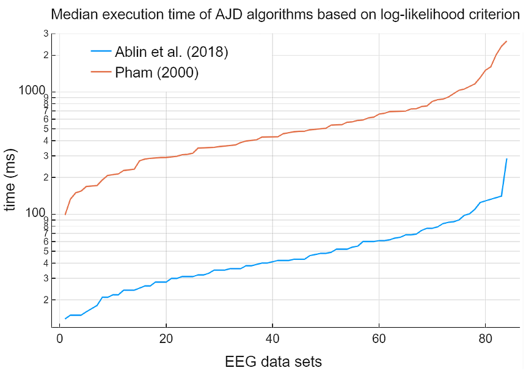

## AJD Algos Benchmark

The *AJDbenchmark.jl* script allows to benchmark the speed performance
of *approximate joint diagonalization* (AJD) algorithms implemented in the
[Diagonalizations.jl](https://github.com/Marco-Congedo/Diagonalizations.jl)
package. To know more about those AJD algorithms
see [here](https://marco-congedo.github.io/Diagonalizations.jl/dev/algorithms/).

As an example, the script compares two AJD algorithms optimizing the log-likelihood criterion: the original *Pham's algorithm* (2000)
and the *quasi-Newton algorithm* of Ablin et al. (2018).

| Figure 'AJD Benchmark'  |  Legend                |
|:-----------------------:|:-----------------------|
|  | *Representative execution time for jointly diagonalizing 47 Fourier cospectra on a database of 84 EEG resting state recordings. On the average the quasi-Newton algorithm executes in about 50ms on these real data. It is about one order of magnitude faster as compared to Pham's algorithm. Note that Pham's algorithm runs several time faster in Julia as compared to Matlab and Python*. The benchmark has been run on a Dell Latitude 5490 laptop equipped with a Intel i7-8650U CPU @1.90GHz (8 logic processors) and with 32Go of RAM  |

The accompanying file `Cospectra.mat` holds Fourier cospectra
computed on 84 eyes-closed resting-state EEG recordings obtained
on healthy individuals (sampling rate: 128, 19 electrodes placed
according to the 10-20 int. system, manual artefact rejection of
corrupted epochs).

For each recording, data has been pre-whitened reducing the dimension,
if needed, so as to keep the smallest dimension explaining at least
99.9% of the total variance. Then, Fourier cospectra have been estimated
by means of the Welch methods, using 256-sample long 50% overlapping
epochs and a Harris tapering window (see the documentation of the
[FourierAnalysis.jl](https://github.com/Marco-Congedo/FourierAnalysis.jl) package), yielding copsectra at 0.5Hz resolution.

The 47 cospectra in the frequency band-pass region 1-24 Hz are submitted
to the AJD algorithms. This is a real-case-scenario usage of AJD
algorithms as the diagonalizations of such matrices yields a blind source
separation method specifically tailored for EEG data (Congedo et al., 2008).

For all algorithms the maximum number of iterations is set to 1000
and the tolerance for convergence is set to 1e-6.
In order to estimate execution time, for each one of the 84 sets of
cospectra the algorithms are run in randomized order `ntrials`
times and the minimum completion time across trials is retained.

All computations for the benckmark are carried out on a single
logical processor.

### References

P. Ablin, J.F. Cardoso, A. Gramfort (2019) [Beyond Pham's algorithm
for joint diagonalization](https://hal.archives-ouvertes.fr/hal-01936887v1),
Proc. ESANN Conference.

Congedo M, Gouy-Pailler C, Jutten C (2018) [On the blind source
separation of human electroencephalogram by approximate joint
diagonalization of second order statistics](https://hal.archives-ouvertes.fr/hal-00343628/document).
Clinical Neurophysiology 119, 2677-2686.

D.-T. Pham (2000) [Joint approximate diagonalization of positive definite
matrices](https://pdfs.semanticscholar.org/0cb5/ca9de76b8893a2549ec278942bb6a5a37a35.pdf?_ga=2.131902607.124228321.1577610632-183244851.1563047228),
SIAM Journal on Matrix Analysis and Applications, 22(4), 1136–1152.
